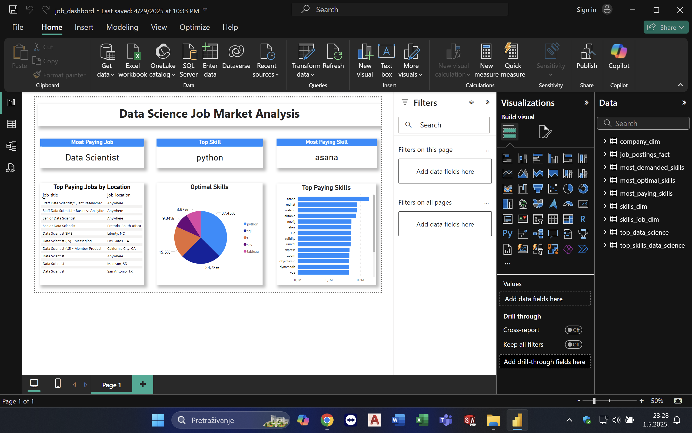

# 📊 Data Science Job Market Dashboard 🚀

This project provides a visual analysis of the Data Science job market using **Power BI** and **SQL**. The goal is to highlight the most in-demand, highest-paying, and most optimal skills for Data Scientist roles based on job posting data.

---

## 🔥 **Dashboard Highlights** 🔥

- **Top Paying Jobs**: Displays the highest-paid Data Science roles by average yearly salary.
- **Most Demanded Skills**: Lists the most frequently mentioned skills in Data Science job postings.
- **Most Paying Skills**: Shows which skills are linked to the highest average salaries.
- **Most Optimal Skills**: Combines both demand and salary to highlight the best overall skills to learn.
- **Interactive Cards**: Callouts showing top skill names and corresponding salary or demand figures.

---

## 🛠️ **Tools Used** 🛠️

- **Power BI** – For building the interactive dashboard.
- **SQL** – For data extraction and transformation.
- **PostgreSQL** – As the database for querying job and skill data.

---

## 📊 **Data Source** 📊

The data was queried from multiple related tables including:

- `job_postings_fact`
- `skills_dim`
- `skills_job_dim`

---

## 📸 **Power BI Dashboard Screenshot** 📸

---

## 📥 Download Power BI Dashboard

You can download the full `.pbix` file from Google Drive using the link below:

👉 [Click here to download the dashboard](https://drive.google.com/file/d/1rWwMrnEwrOwvpl8FU8ZcLnYHhLdU3yt_/view?usp=share_link)

